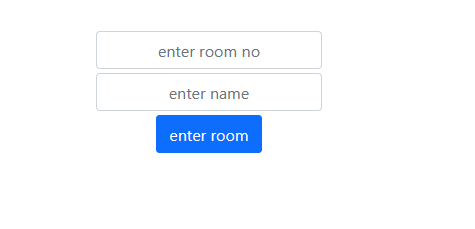
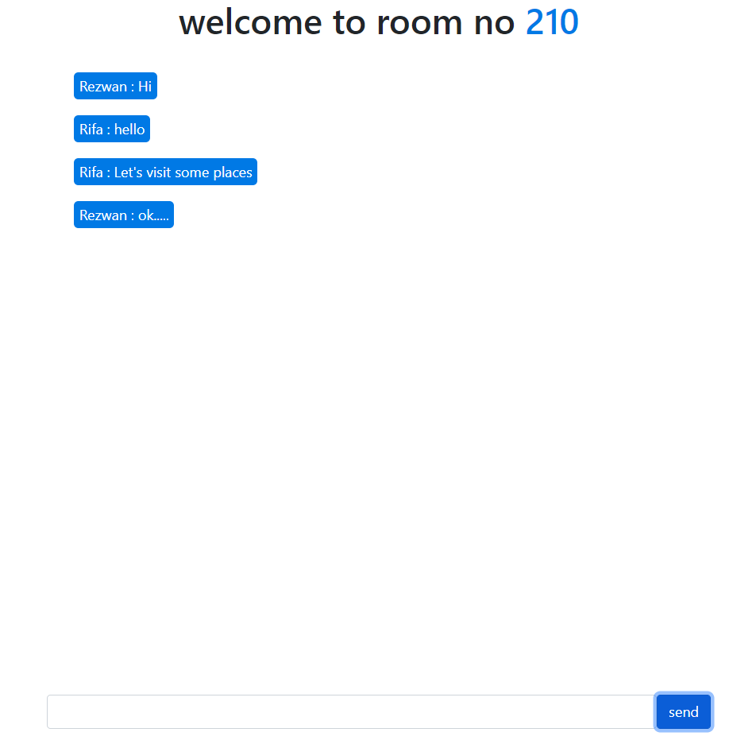

# Installation

- 1 - create a virtual environment and activate
- 2 - pip install virtualenv
- - virtualenv envname
- - envname\scripts\activate
- 3 - cd into project
- 4 - pip install -r requirements.txt
- 5 - python manage.py runserver
- 6 - For windows Find the 'redis server' folder, extract the zip file, and open redis-server.exe to start the server

# Features

- Create Room
- Socket Programming
- Channels

# Tech Stack

- Django
- Redis
- Django Channels

# Home Page

# Room Page

